# Operationalizing Machine Learning
Udacity Nanodegree Machine Learning Engineer with Azure, Submission for the 2nd Task.
Batuhan Ipekci

This project demonstrates 2 alternative ways of deploying a trained model on Azure Machine Learning Studio. At first, the deployment of an AutoML run has been submitted through the user interface of Azure ML Studio. Later, the same process has been done via Python SDK. Both endpoints of those processes have been checked through an HTTP POST request communicating the sample data through a JSON object. At the end, a well-rounded introduction to all the tools in the Azure ML Studio has been accomplished.

## Architectural Diagram

At least 10 steps can be defined which are key for completing this project.
- **Stage 1:** A dataset has been downloaded from an external source and uploaded to Azure ML Studio, and there it was converted to a Datastore object under the hood.
- **Stage 2:** A "New AutomatedML Run" has been defined with a compute cluster of relevant size and run configuration (Concurrency and exit criterion). The uploaded Datastore object has been inserted.
- **Stage 3:** The AutomatedML run has prepared the dataset, selected the best features, found the voting scheme of the best models available (an Voting Ensemble of various models - most importantly gradient boosters with different hyperparameters) and tuned them using advanced default Hyperparameter sampling techniques.
- **Stage 4:** Meanwhile, logging has been enabled through a Python script (log.py) which updates the already initialized Webservice object. 
- **Stage 5:** After the AutoML process has been completed, the best model (Voting Ensemble) has been deployed via the relevant button in Azure ML Studio. In order to communicate to the API, the endpoint URI and the access primary key were saved.
- **Stage 6:** The swagger json has been extracted from the Run object in the Azure ML Studio. It is deployed on localhost as to understand its signature (allowed HTTP methods (GET and POST) and the sample data). The local deployment was made in a Docker container, which configures the swagger installation (Check swagger.sh). The Python script serve.py runs the HTTP context for the local deployment.
- **Stage 7:** An HTTP Post request has been sent via endpoint.py, where a sample data has been provided. The prediction for the data points were received as a JSON object which was sent by the API endpoint for the machine learning model.
- **Stage 8:** The performance of the API endpoint has been tested using Apache Benchmark. The average requests per second was about 8, implying the average response time being way below the Azure maximum of 60 seconds. The bash command in benchmark.sh has been modified with the key in the header and the URI for the API endpoint.
- **Stage 9:** The same steps for AutoML has been repeated using Python SDK. The most important difference was the Pipeline object, which can be very flexible and receive many other scripts down the line. The implementation can be traced in aml-pipelines-with-automated-machine-learning-step.ipynb. 
- **Stage 10:** A pipeline endpoint has been created. The communication with this API has been captured in a screencast video that can be found in the Screen Recording section.
 
It has been a very useful project to operate on Azure ML Studio using two different ways. Many of the basic tools and operations were explored. To improve the project, advanced techniques which decrease computational costs like pipeline processing (parallel runs in batches) could be applied. Another to do might be scaling the project even further using Azure Kubernetes Service rather than Azure Container Instance (as the default choice here). The models can be exported using Open Neural Network Exchange (ONNX) format, which would allow us to run on a variety of platforms and services. Having deployed a good performing Machine Learning model that easily in Azure ML Studio would certainly encourage the developers to focus on building additional application in backend and frontend. That would be for me the best way of expanding this project.

## Key Steps
The following screenshots gives further detail on the steps that were explained above:
1. Registered Datasets: The Bankmarketing.csv has been registered (Stage 1).
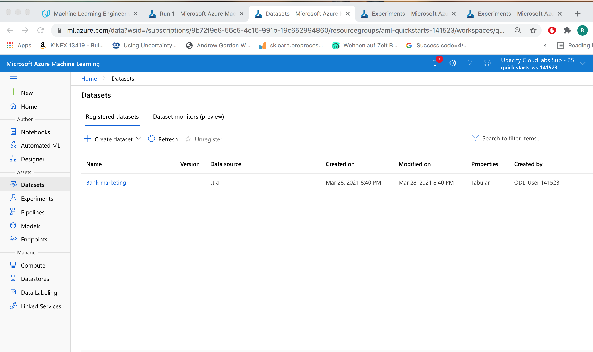

2. The experiment as completed: The AutoML Run (Run 1) has run with success (Stage 2). 
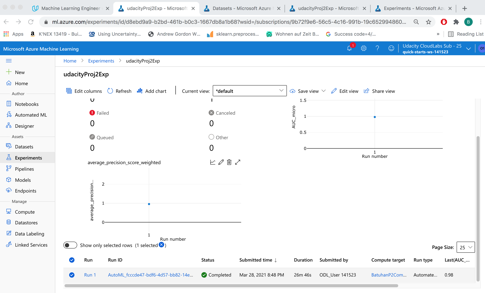

3. Best model: Voting Ensemble with 0.92 accuracy (Stage 3).
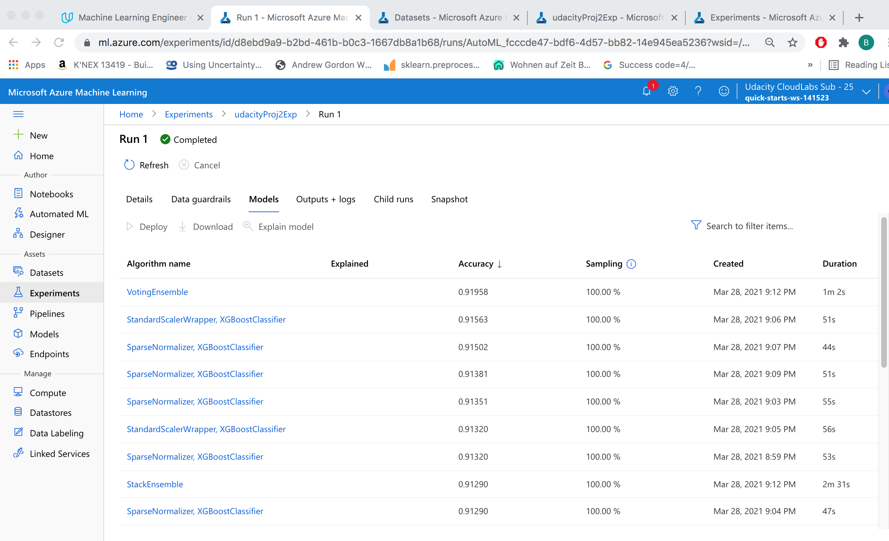

4. Enabling Logging: Done via logs.py (Stage 4).
 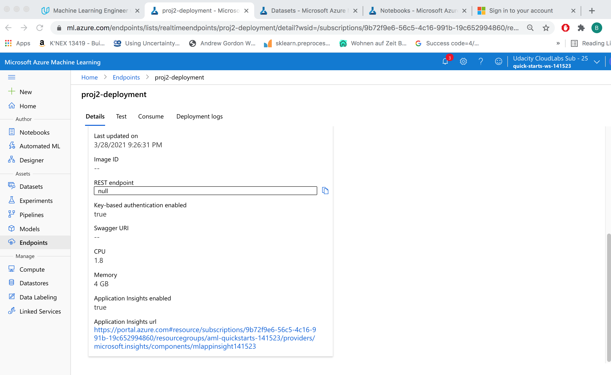
 
5. Log file: printed on the console after running logs.py (Stage 4).
 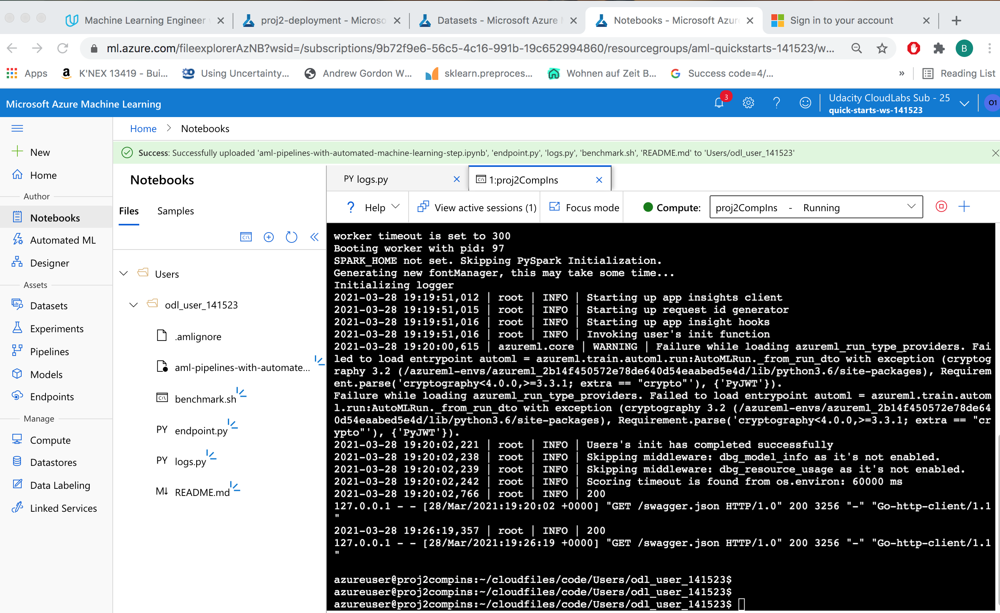

6. Swagger Documentation: GET and POST methods, POST with sample data (Stage 6).
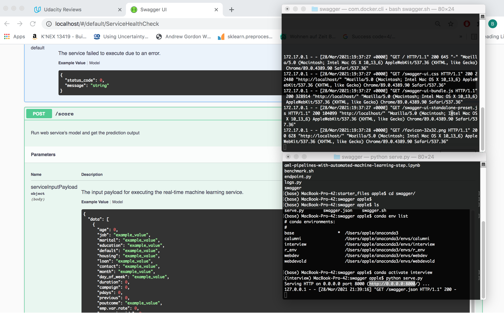

7. POST sample to Endpoint: Console output after running endpoint.py (Stage 7).
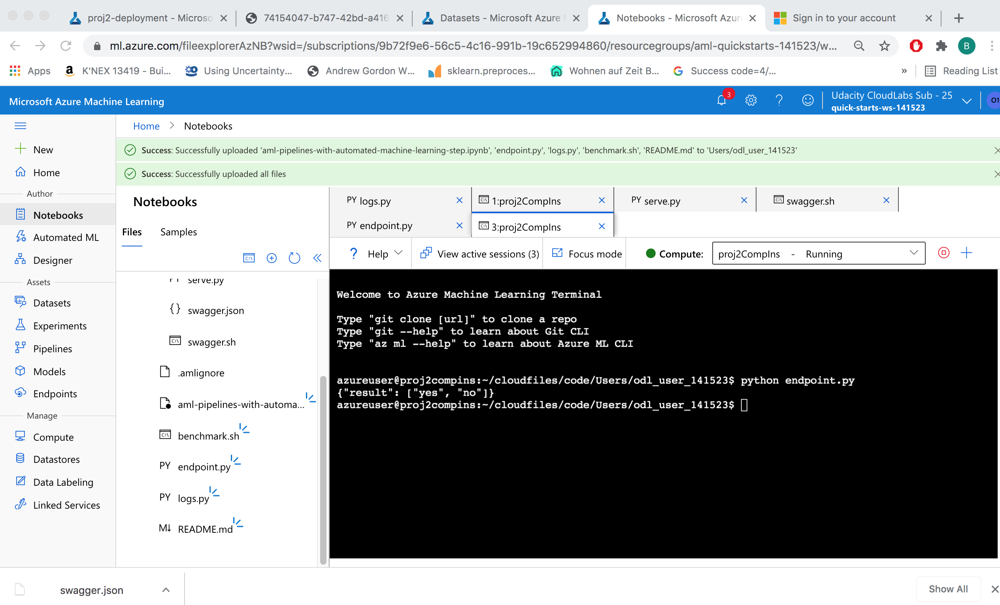

8. Benchmarking the API 1: The console output for a request with HTTP 200 code (Stage 8).
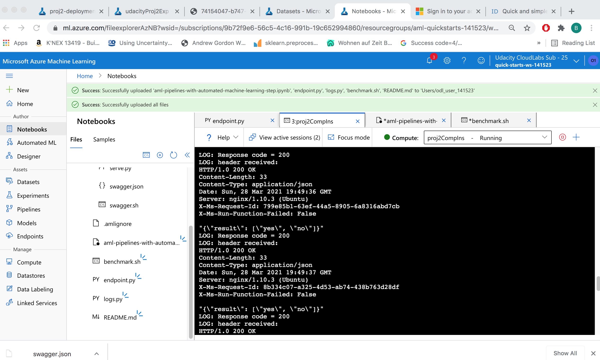

9. Benchmarking the API 2: The console output for the summary. 8.26 requests per second (Stage 8).
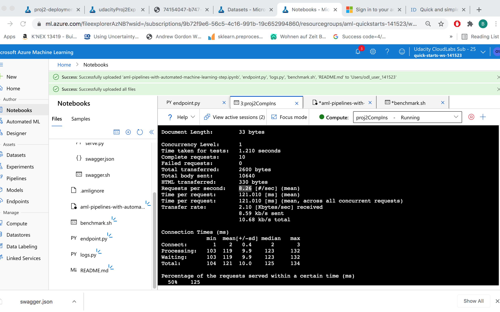

10. Pipeline Created: The Pipeline run with AutoML Step was initialized through Notebook cells (Stage 9). 
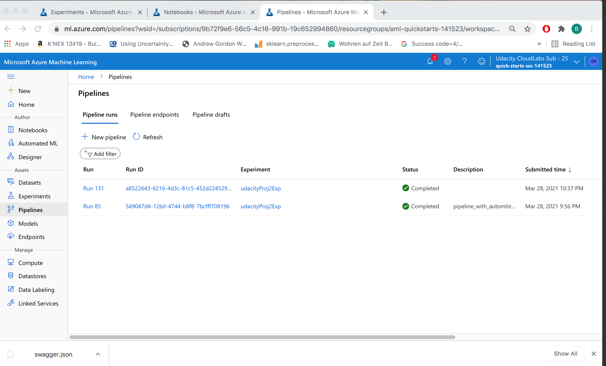

11. Pipeline Endpoint 1: The Pipeline run with AutoML Step was initialized through Notebook cells (Stage 9). 
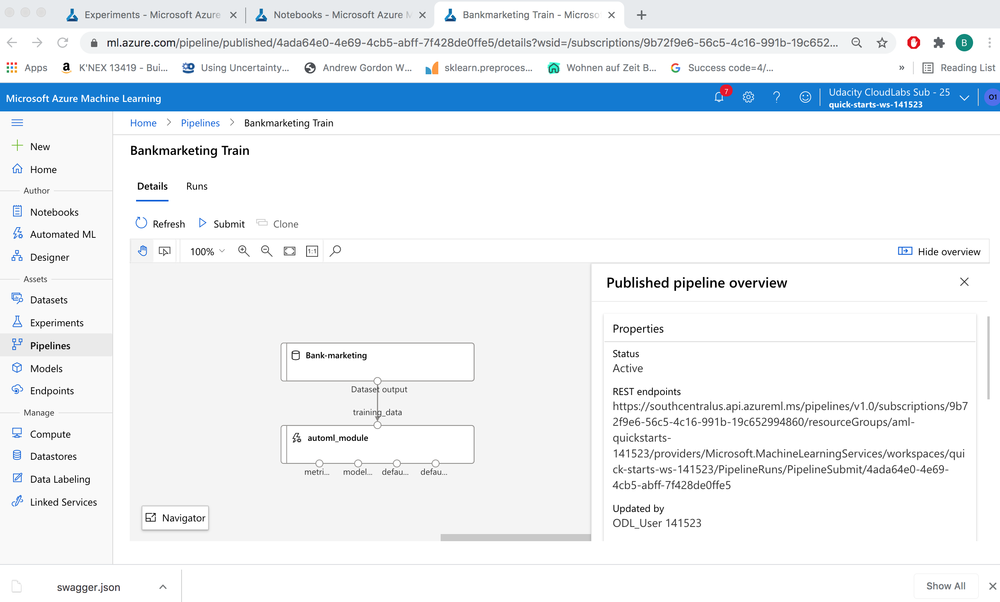

12. Pipeline Endpoint 2: as Finished Run and Active Status (Stage 9).

13. RunDetails widget: Showing the progress of the Pipeline steps (Stage 9).
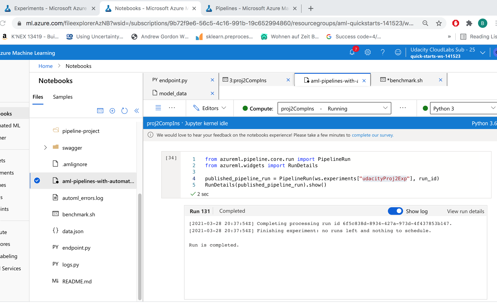

14. Scheduled Run in ML Studio: Scheduled Run with the Completed Status (Stage 9).
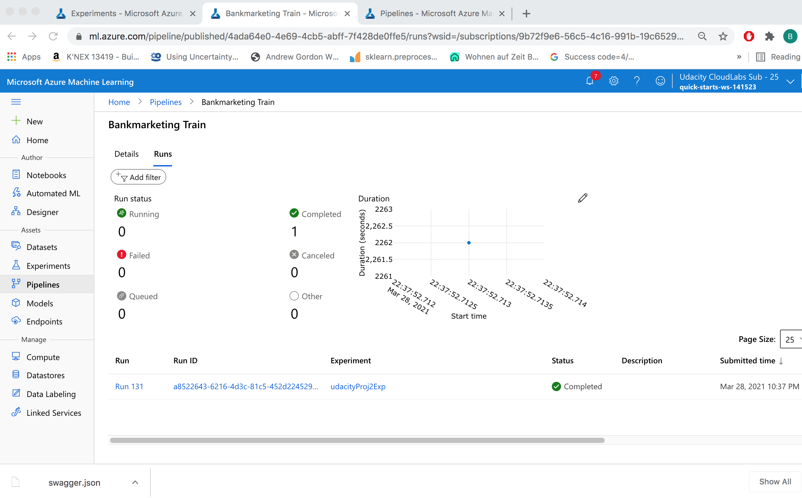

## Screen Recording
The Link to the Screencast:
https://www.youtube.com/watch?v=xXZodFZjTAY&ab_channel=Batuhan%C4%B0pek%C3%A7i 

The screencast demonstrates the working ML model endpoint which was successfully deployed, the pipeline object, the chosen AutoML model, and the communication with the endpoint through a JSON payload.

## Standout Suggestions
The process of load-test the endpoint Apache Benchmark (Stage 8) was documented.
