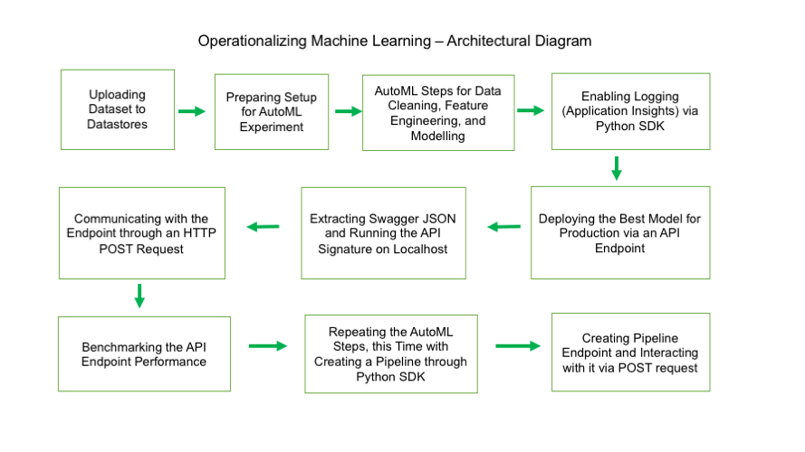

# Operationalizing Machine Learning
Udacity Nanodegree Machine Learning Engineer with Azure, Submission for the 2nd Task.
Batuhan Ipekci

This project demonstrates 2 alternative ways of deploying a trained model on Azure Machine Learning Studio. At first, the deployment of an AutoML run has been submitted through the user interface of Azure ML Studio. Later, the same process has been done via Python SDK. Both endpoints of those processes have been checked through an HTTP POST request communicating the sample data through a JSON object. At the end, a well-rounded introduction to all the tools in the Azure ML Studio has been accomplished.

## Architectural Diagram

At least 10 steps can be defined which are key for completing this project.
**Stage 1:** A dataset has been downloaded from an external source and uploaded to Azure ML Studio, and there it was converted to a Datastore object under the hood.
**Stage 2:** A "New AutomatedML Run" has been defined with a compute cluster of relevant size and run configuration (Concurrency and exit criterion). The uploaded Datastore object has been inserted.
**Stage 3:** The AutomatedML run has prepared the dataset, selected the best features, found the voting scheme of the best models available (an Voting Ensemble of various models - most importantly gradient boosters with different hyperparameters) and tuned them using advanced default Hyperparameter sampling techniques.
**Stage 4:** Meanwhile, logging has been enabled through a Python script (log.py) which updates the already initialized Webservice object. 
**Stage 5:** After the AutoML process has been completed, the best model (Voting Ensemble) has been deployed via the relevant button in Azure ML Studio. In order to communicate to the API, the endpoint URI and the access primary key were saved.
**Stage 6:** The performance of the API endpoint has been tested using Apache Benchmark. The average response time was about 9 seconds, way below the Azure maximum allowed response time of 60 seconds. The bash command in benchmark.sh has been modified with the key in the header and the URI for the API endpoint.
**Stage 7:** The swagger json has been extracted from the Run object in the Azure ML Studio. It is deployed on localhost as to understand its signature (allowed HTTP methods (GET and POST) and the sample data). The local deployment was made in a Docker container, which configures the swagger installation (Check swagger.sh). The Python script serve.py runs the HTTP context for the local deployment.
**Stage 8:** An HTTP Post request has been sent via endpoint.py, where a sample data has been provided. The prediction for the data points were received as a JSON object which was sent by the API endpoint for the machine learning model.
**Stage 9:** The same steps for AutoML has been repeated using Python SDK. The most important difference was the Pipeline object, which can be very flexible and receive many other scripts down the line. The implementation can be traced in aml-pipelines-with-automated-machine-learning-step.ipynb. 
**Stage 10:** A pipeline endpoint has been created. The communication with this API has been captured in a video that can be found in https://www.youtube.com/watch?v=xXZodFZjTAY&ab_channel=Batuhan%C4%B0pek%C3%A7i 
 

## Key Steps
*TODO*: Write a short discription of the key steps. Remeber to include all the screenshots required to demonstrate key steps. 

## Screen Recording
*TODO* Provide a link to a screen recording of the project in action. Remember that the screencast should demonstrate:

## Standout Suggestions
*TODO (Optional):* This is where you can provide information about any standout suggestions that you have attempted.
